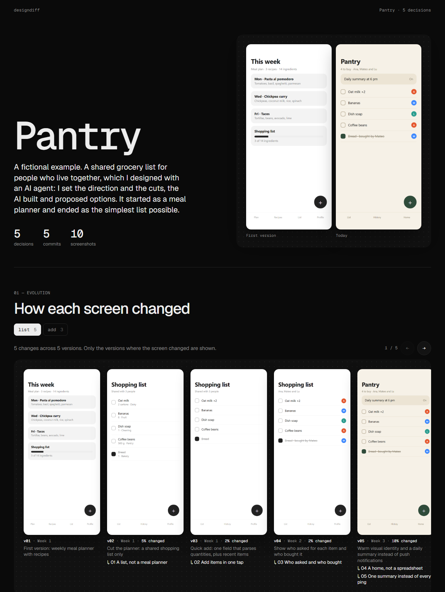
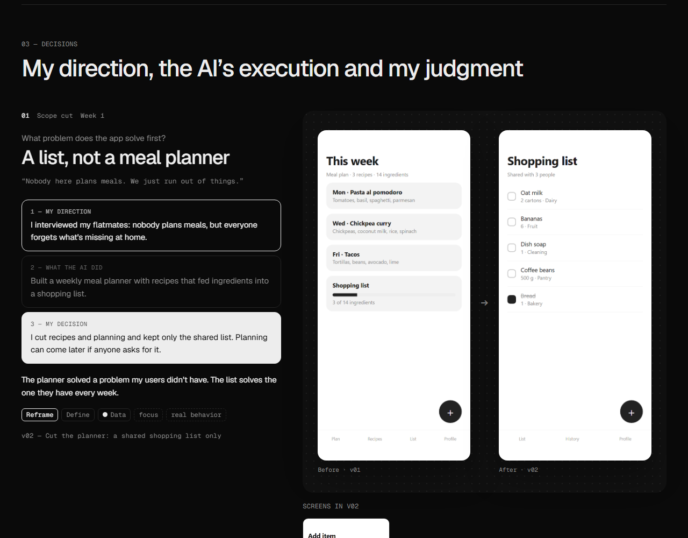

# designdiff

**English** · [Español](#español)

Anyone can build a good-looking app in an afternoon with AI. So the finished product no longer shows how you think. **The process does.**

`designdiff` reads your sessions with AI coding agents (Claude Code and Codex) and your git history. It finds the moments where you corrected, cut or reframed what the AI proposed, and builds a timeline with screenshots of the app before and after each decision. Design, product and code decisions all count.





*Pantry is a fictional project made to show the output. Its data lives in [`examples/pantry`](examples/pantry): open `proceso.html` in a browser, or regenerate it with `node src/render.mjs examples/pantry`.*

## What it does

- Reads a project's **Claude Code** and **Codex** sessions, even if you used both.
- Filters out the noise ("ok", "done", deploy setup) and keeps the messages where a decision happened.
- For each decision, shows three steps: **your direction** (brief, references, the problem you spotted), **what the AI did** and **what you decided**. It tells the story of the collaboration, not a summary of what the AI built.
- Runs your app at every commit that touched the UI, in a separate copy, and takes screenshots.
- When a decision doesn't show on screen (an architecture or dependency call, say), it shows the code that changed instead.
- Analyzes every decision with four design frameworks: design rationale (what was being decided and by which criteria), reflective practice (did it reframe the problem or adjust the solution), the Double Diamond (which phase) and the Six Thinking Hats (which kind of thinking drove it). See [`docs/theory.md`](docs/theory.md).
- Generates an HTML page that opens with **"How it was thought through"**: the criteria that repeat across decisions (your real design principles), reframes vs. adjustments, the path through the Double Diamond and the thinking profile. Then the timeline, ready to use as the base for a case study.

## What it doesn't do

- It doesn't publish anything. Everything runs on your machine and the output goes to `~/.designdiff/<project>/`, outside any repo.
- It doesn't invent decisions: an agent proposes the moments and **you review them** before the page is generated.
- It doesn't replace your own privacy review. It masks emails, tokens, amounts and account numbers, but conversations can contain other things you may not want to show.
- It doesn't capture screens behind a real login or with data from a database. It can skip onboarding, navigate and load demo data in `localStorage`, set up per project in `designdiff.json`.
- It doesn't read sessions from Cursor or other tools yet.
- Screenshots only work with Next.js projects for now.

## Install

designdiff is an agent skill. Install it with:

```bash
npx skills add tomasgposse/designdiff
```

Or clone it into your skills folder (for Claude Code, `~/.claude/skills/designdiff`).

## Usage

Open your project with your agent and ask for it, for example: *"Use designdiff to show the design process behind this project."* The agent runs the steps in [`SKILL.md`](SKILL.md), proposes the decisions, and **asks you to review them** before generating the page.

You can also run the scripts yourself:

```bash
node src/extract.mjs ../my-project            # sessions + git -> candidates
node src/capture.mjs ../my-project            # optional: screenshots at every UI commit
# an agent reads candidates.json and writes moments.json (see SKILL.md)
node src/render.mjs ~/.designdiff/my-project  # -> proceso.html
```

Requires Node 22+. Screenshots also need Chrome or Edge and a Next.js project. Tested on Windows; macOS and Linux should work but are untested.

The page comes out in English by default, or in the language set in `moments.json` (English and Spanish for now).

---

## Español

Hoy cualquiera puede construir una app linda en una tarde con IA. Por eso el producto terminado ya no muestra cómo pensás. **El proceso sí.**

`designdiff` lee tus sesiones con agentes de IA (Claude Code y Codex) y tu historial de git. Encuentra los momentos en que corregiste, recortaste o redefiniste lo que proponía la IA, y arma una línea de tiempo con capturas de cómo se veía la app antes y después de cada decisión. Cuentan las decisiones de diseño, de producto y de código.

Las capturas de arriba muestran el resultado con **Pantry**, un proyecto ficticio armado para el ejemplo. Sus datos están en [`examples/pantry`](examples/pantry).

### Qué hace

- Lee las sesiones de **Claude Code** y **Codex** de un proyecto, aunque hayas usado las dos.
- Filtra el ruido ("dale", "listo", configurar el deploy) y se queda con los mensajes donde hubo una decisión.
- Para cada decisión, muestra tres pasos: **tu dirección** (brief, referencias, el problema que detectaste), **lo que hizo la IA** y **lo que decidiste vos**. Cuenta el trabajo en conjunto, no un resumen de lo que construyó la IA.
- Levanta tu app en cada commit con cambios de UI, en una copia aparte, y saca capturas.
- Si la decisión no se ve en pantalla (por ejemplo, de arquitectura o de dependencias), muestra el código que cambió.
- Analiza cada decisión con cuatro marcos de diseño: design rationale (qué se decidía y con qué criterio), práctica reflexiva (si reencuadró el problema o ajustó la solución), doble diamante (en qué fase) y seis sombreros (desde qué tipo de pensamiento). Están explicados en [`docs/teoria.md`](docs/teoria.md) (en inglés: [`docs/theory.md`](docs/theory.md)).
- Genera una página HTML que arranca con **"Cómo se pensó"**: los criterios que se repiten entre decisiones (tus principios de diseño reales), reencuadres contra ajustes, el recorrido por el doble diamante y el perfil de pensamiento. Después, la línea de tiempo, lista para usar como base de un caso de estudio.

### Qué no hace

- No publica nada. Todo corre en tu máquina y la salida queda en `~/.designdiff/<proyecto>/`, fuera de cualquier repo.
- No inventa decisiones: un agente propone los momentos y **vos los revisás** antes de generar la página.
- No reemplaza tu revisión de privacidad. Tapa mails, tokens, montos y números de cuenta, pero las conversaciones pueden tener otras cosas que no quieras mostrar.
- No captura pantallas detrás de un login real ni con datos de una base. Sí puede saltear el onboarding, navegar y cargar datos de demo en `localStorage`, configurado por proyecto en `designdiff.json`.
- Por ahora no lee sesiones de Cursor ni de otras herramientas.
- Por ahora las capturas solo funcionan con proyectos Next.js.

### Instalación

designdiff es una skill para agentes. Se instala con:

```bash
npx skills add tomasgposse/designdiff
```

O cloná el repo en tu carpeta de skills (en Claude Code, `~/.claude/skills/designdiff`).

### Uso

Abrí tu proyecto con tu agente y pedíselo, por ejemplo: *"Usá designdiff para mostrar el proceso de diseño de este proyecto."* El agente sigue los pasos de [`SKILL.md`](SKILL.md), propone las decisiones y **te pide que las revises** antes de generar la página.

También podés correr los scripts vos:

```bash
node src/extract.mjs ../mi-proyecto            # sesiones + git -> candidatos
node src/capture.mjs ../mi-proyecto            # opcional: capturas en cada commit de UI
# un agente lee candidates.json y escribe moments.json (ver SKILL.md)
node src/render.mjs ~/.designdiff/mi-proyecto  # -> proceso.html
```

Requiere Node 22+. Las capturas necesitan además Chrome o Edge y un proyecto Next.js. Probado en Windows; en macOS y Linux debería funcionar, pero todavía no se probó.

La página sale en inglés por defecto, o en el idioma indicado en `moments.json` (por ahora inglés y español).

## License · Licencia

MIT
